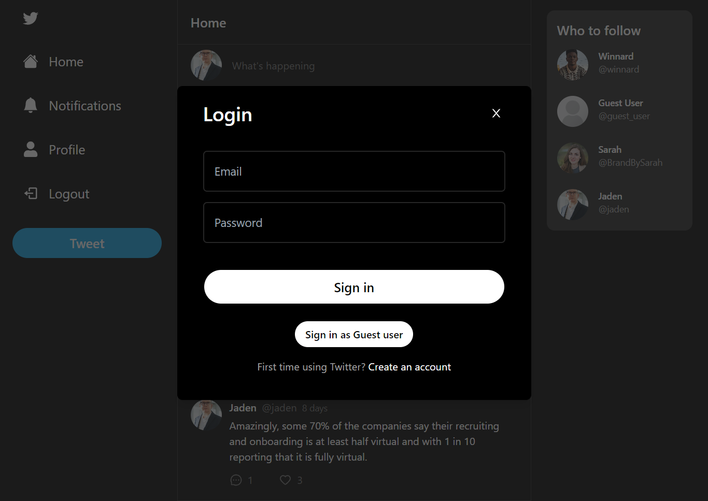
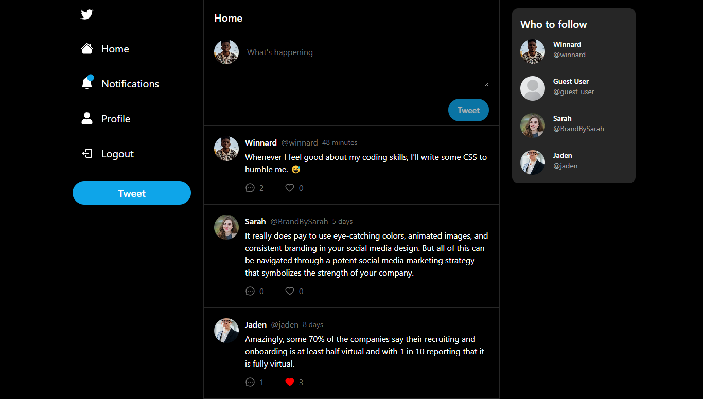
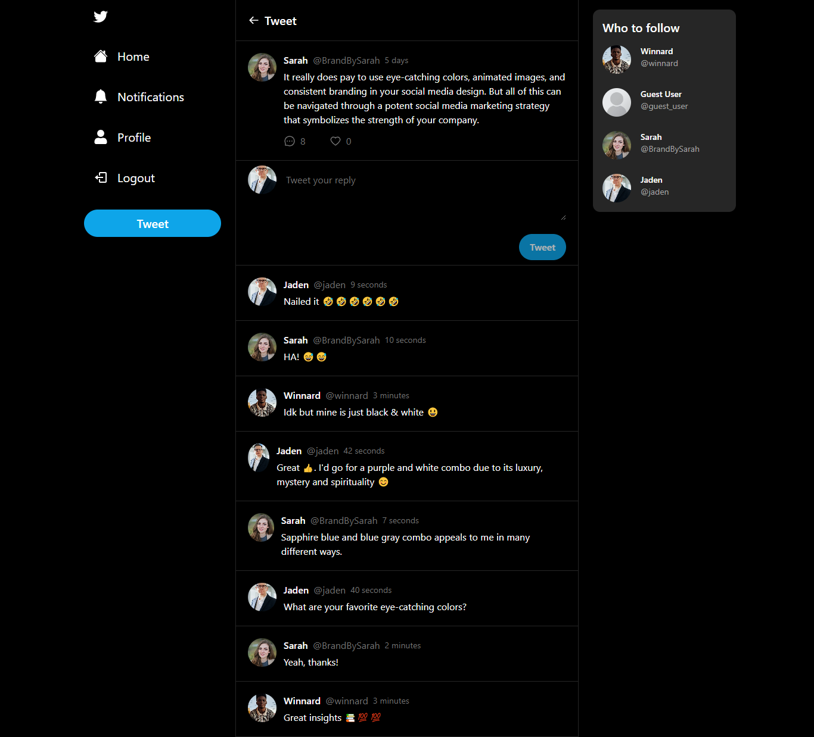
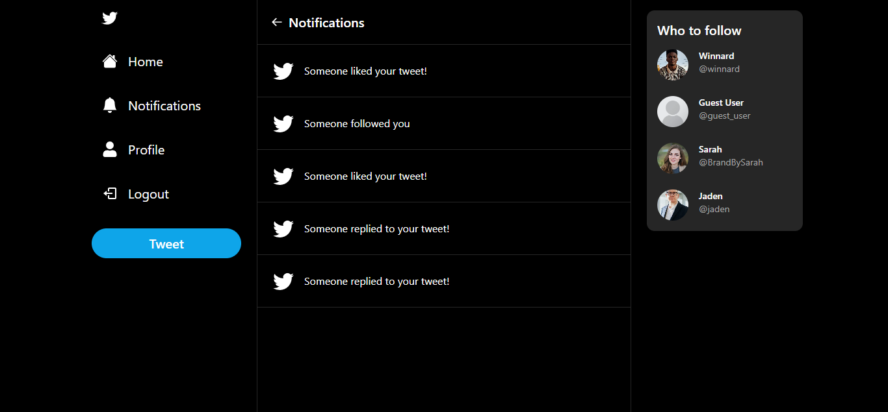
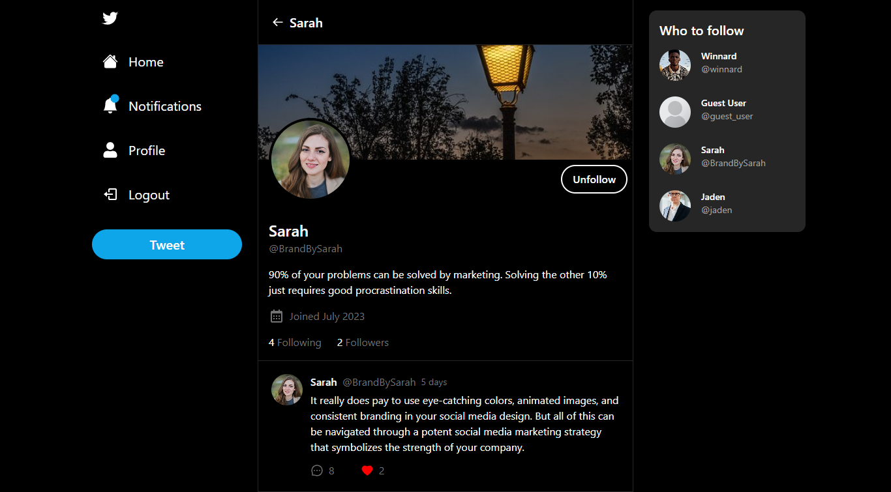
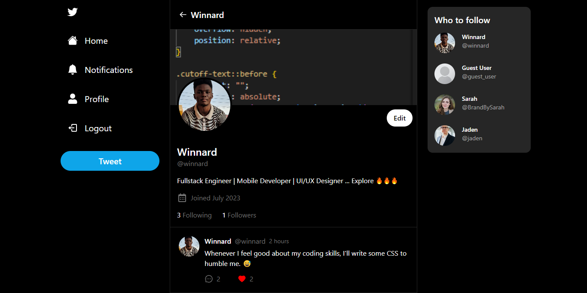
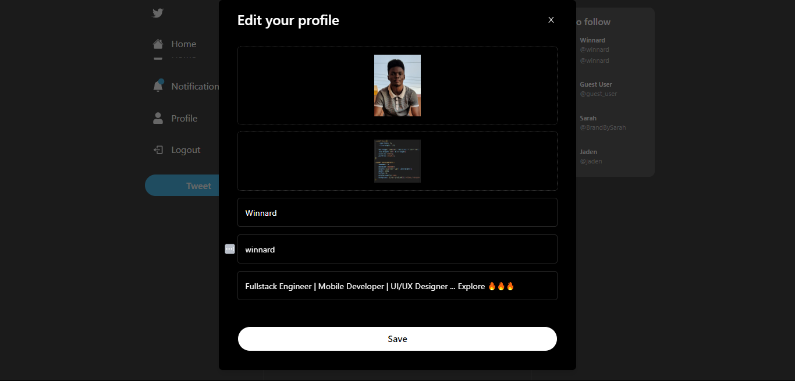

# To Begin

## Auth



## Home Screen



## Comments



## Notifications



## User Details (Other User's Profile)



## Profile (Current User)



## Profile update



## Available scripts

First, run the development server:

```bash
npm run dev
# or
yarn dev
# or
pnpm dev
```

Open [http://localhost:3000](http://localhost:3000) with your browser to see the result.

The page will reload when you make changes.\
You may also see any lint warnings in the console.

## Deployment

You can find a demo of twitter-clone at (twitter-clone)(https://twitter-clone-alpha-plum.vercel.app/)
